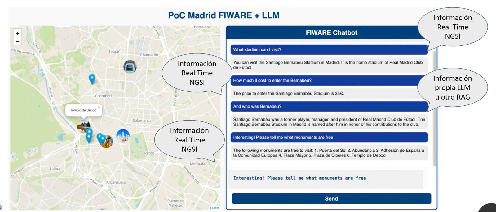

# real-time-spatial-rag-for-smart-cities
Real time spatial RAG for Smart Cities using FIWARE


## App deployment 

### Download the desired map
Download and copy the desired `.mbtiles` in the `./src/map` folder


1. [Madrid Map](https://drive.upm.es/s/17y49EZQJm90m1J) 
2. [Naples Map](https://drive.upm.es/s/ntikqYe2zqudukx)


### Serve the map

```
cd src/map
docker run -it -v $(pwd):/data -p 8080:8080 maptiler/tileserver-gl:v4.6.6 --verbose
``` 
You can access localhost:8080 to see if the map was loaded correctly


### Configure API OPEN-AI
```
cd src
cp template.env .env
# modify OPENAI_API_KEY with your OPENAI_API_KEY 
```

### Configure the map
Modify `.env` with the initial position to be loaded

```
# MADRID -> 41.65606, -0.87734
# NAPLES -> 40.85216, 14.26811 
INITIAL_LATITUDE=41.65606
INITIAL_LONGITUDE=-0.87734
INITIAL_ZOOM=13
```

### Build the POC
```
cd src
npm install
npm run build
```

You should see a message like
```
Build complete!
```

All previous steps should be performed only the first time, except the map serving that should be run as a part of the app.

### Start FIWARE GEs

```
cd src
docker compose up -d
```

### Populate Context Broker with entities:
```
cd src/data
./generated_provision_{city}.sh # city you loaded the map
```

## Start playing

Open index.html and start playing...


